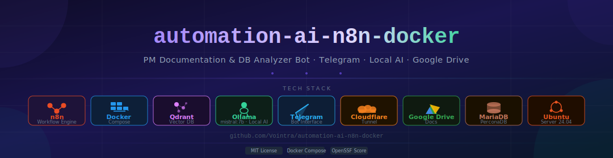

# Docker n8n AI - PM Documentation DB Analyzer Bot


[](https://securityscorecards.dev/viewer/?uri=github.com/Vointra/automation-ai-n8n-docker)
[](https://github.com/Vointra/automation-ai-n8n-docker/actions/workflows/scorecard.yml)
[](https://github.com/Vointra/automation-ai-n8n-docker/actions/workflows/validate.yml)
[](LICENSE)

This project provides a Docker-based automation stack for **n8n**, **Qdrant**, **Cloudflare Tunnel**, **Telegram Bot**, **Google Drive**, and local AI via **Ollama**. The main workflow receives commands from Telegram, reads PM (Preventive Maintenance) archives from MariaDB/PerconaDB, analyzes the data using a local AI model, generates reports in Markdown/DOCX/HTML format, and automatically creates Google Docs output.

The n8n workflow export file is located at:

```text
script-flow-n8n/PM-Documentation-DB-Analyzer-Bot-v8.json
```

---

## Table of Contents

- [Architecture](#architecture)
- [Requirements](#requirements)
- [VM Directory Layout](#vm-directory-layout)
- [Installation](#installation)
- [Cloudflare Tunnel Setup](#cloudflare-tunnel-setup)
- [Ollama / Local AI Setup](#ollama--local-ai-setup)
- [n8n Workflow Setup](#n8n-workflow-setup)
- [Telegram Commands](#telegram-commands)
- [Operations](#operations)
- [OpenSSF Scorecard](#openssf-scorecard)
- [Security Before Publishing](#security-before-publishing)
- [Troubleshooting](#troubleshooting)
- [Repository Structure](#repository-structure)
- [License](#license)

---

## Architecture

Main components of this stack:

| Component | Purpose |
| --- | --- |
| n8n | Workflow engine for Telegram, Google Drive, Google Docs, and PM report processing |
| Qdrant | Vector database for RAG and context retrieval |
| Cloudflare Tunnel | Public HTTPS access to n8n without directly exposing the VM port |
| Ollama | Local AI runtime for PM and database analysis |
| Telegram Bot | User-facing command interface |
| Google Drive | Integration for creating and storing Google Docs |
| Docker Compose | Service orchestration on the Ubuntu VM |

Service ports are bound to localhost on the VM:

```text
n8n    : 127.0.0.1:5678
Qdrant : 127.0.0.1:6333 and 127.0.0.1:6334
```

Public access to n8n should go through Cloudflare Tunnel to `http://n8n:5678` or `http://localhost:5678`, depending on the tunnel configuration.

---

## Requirements

Recommended server baseline:

| Requirement | Recommendation |
| --- | --- |
| OS | Ubuntu Server 24.04 LTS |
| CPU | Minimum 4 vCPU, 8 vCPU recommended if local AI runs on the same host |
| RAM | Minimum 8 GB, 16 GB or more recommended |
| Storage | Minimum 50 GB, SSD recommended |
| Docker | Latest Docker Engine |
| Compose | Docker Compose plugin (`docker compose`) |
| Domain | Domain or subdomain managed in Cloudflare |
| Local AI | Ollama with the required model, default workflow model is `mistral:7b` |
| External accounts | Telegram Bot token and Google Drive OAuth credential |

Base packages required on the host:

```bash
sudo apt update
sudo apt install -y ca-certificates curl git
```

---

## VM Directory Layout

Host folders mounted into the n8n container:

| VM Folder | Container Mount | Purpose |
| --- | --- | --- |
| `/home/user/pm_source` | `/home/user/pm_source` | Source PM archives: `.tar`, `.tar.gz`, `.tgz`, `.tar.bz2` |
| `/home/user/pm_output` | `/home/user/pm_output` | Markdown reports and intermediate output from `/pm` |
| `/home/user/pm_docx` | `/home/user/pm_docx` | DOCX output |
| `/home/user/pm_docs` | `/home/user/pm_docs` | HTML/Markdown output from `/gendoc` and `/listdoc` |
| `/home/user/pm_template` | `/home/user/pm_template` | Optional document template folder |
| `./n8n_data` | `/home/node/.n8n` | n8n internal data |
| `/tmp/pm_work` | `/tmp/pm_work` | Temporary working directory |
| `/tmp/pm_extracted` | `/tmp/pm_extracted` | Temporary extracted archive directory |

Create the following folders before starting the stack:

```bash
sudo mkdir -p /home/user/pm_source /home/user/pm_output /home/user/pm_docx /home/user/pm_docs /home/user/pm_template
sudo mkdir -p /tmp/pm_work /tmp/pm_extracted
sudo chown -R 1000:1000 /home/user/pm_source /home/user/pm_output /home/user/pm_docx /home/user/pm_docs /home/user/pm_template
```

---

## Installation

### 1. Clone the repository on the VM

```bash
git clone https://github.com/Vointra/automation-ai-n8n-docker.git
cd automation-ai-n8n-docker
```

### 2. Create the environment file

```bash
cp .env.example .env
nano .env
```

Fill in the following variables:

| Variable | Description |
| --- | --- |
| `N8N_HOST` | n8n domain, e.g. `n8n.example.com` |
| `N8N_PROTOCOL` | Use `https` when exposed through Cloudflare |
| `WEBHOOK_URL` | Public n8n URL, e.g. `https://n8n.example.com/` |
| `CLOUDFLARED_TUNNEL_TOKEN` | Cloudflare Tunnel token |
| `TELEGRAM_BOT_TOKEN` | Telegram token from BotFather |
| `OLLAMA_BASE_URL` | Ollama URL, e.g. `http://host.docker.internal:11434` |
| `MARIADB_HOST` | Target MariaDB host or IP |
| `MARIADB_PORT` | MariaDB port, default `3306` |
| `MARIADB_USER` | MariaDB user |
| `MARIADB_PASSWORD` | MariaDB password |
| `SSH_HOST`, `SSH_USER`, `SSH_PORT` | Target SSH access if used by the workflow |

### 3. Build and start the stack

```bash
docker compose up -d --build
```

### 4. Check the containers

```bash
docker compose ps
docker compose logs -f n8n
```

### 5. Access n8n

Local VM access:

```text
http://127.0.0.1:5678
```

Cloudflare Tunnel access:

```text
https://your-n8n-domain.example.com
```

---

## Cloudflare Tunnel Setup

In Cloudflare Zero Trust:

1. Create a new tunnel.
2. Select Docker as the environment.
3. Copy the tunnel token into `.env` as `CLOUDFLARED_TUNNEL_TOKEN`.
4. Create a Public Hostname, for example:

```text
Subdomain : n8n
Domain    : example.com
Service   : http://n8n:5678
```

If the tunnel service cannot resolve the container name `n8n`, use:

```text
http://localhost:5678
```

---

## Ollama / Local AI Setup

If Ollama runs on the VM host:

```bash
curl -fsSL https://ollama.com/install.sh | sh
ollama pull mistral:7b
```

Make sure Ollama is reachable from the n8n container. Example `.env` value:

```text
OLLAMA_BASE_URL=http://host.docker.internal:11434
```

Test from inside the n8n container:

```bash
docker exec -it n8n sh
wget -qO- http://host.docker.internal:11434/api/tags
```

---

## n8n Workflow Setup

1. Log in to n8n.
2. Open `Workflows`.
3. Import the following workflow file:

```text
script-flow-n8n/PM-Documentation-DB-Analyzer-Bot-v8.json
```

4. Configure credentials for the following nodes:

| Credential | Used By |
| --- | --- |
| Telegram account | Telegram Trigger and Telegram send message/file nodes |
| Google Drive account | Nodes for creating and updating Google Docs files |

5. Activate the workflow once the credentials are valid.

---

## Telegram Commands

Main commands available in the workflow:

| Command | Purpose |
| --- | --- |
| `/help` | Show command help |
| `/list` | List PM archives in `/home/user/pm_source` |
| `/pm 1` | Process a PM archive by number from `/list` |
| `/pm filename.tar.gz` | Process a PM archive by exact filename |
| `/gendoc` | List Markdown reports available for document generation |
| `/gendoc 1` | Generate HTML output from a Markdown report |
| `/gendoc 1 --md` | Send the output in Markdown format |
| `/listdoc` | List generated HTML/Markdown files in `/home/user/pm_docs` |

Upload a PM archive to the VM:

```bash
scp file_pm.tar.gz user@<vm-ip>:/home/user/pm_source/
```

Then run from Telegram:

```text
/list
/pm 1
```

---

## Operations

Common operational commands:

```bash
docker compose ps
docker compose logs -f n8n
docker compose logs -f qdrant
docker compose restart n8n
docker compose down
docker compose up -d --build
```

Back up n8n data:

```bash
tar -czf n8n_data_backup_$(date +%F).tar.gz n8n_data
```

Back up PM folders:

```bash
sudo tar -czf pm_data_backup_$(date +%F).tar.gz \
  /home/user/pm_source \
  /home/user/pm_output \
  /home/user/pm_docx \
  /home/user/pm_docs \
  /home/user/pm_template
```

---

## OpenSSF Scorecard

This repository includes a GitHub Actions workflow at:

```text
.github/workflows/scorecard.yml
```

This workflow publishes results to OpenSSF Scorecard and uploads SARIF results to GitHub code scanning. After this repository is pushed to GitHub, run `OpenSSF Scorecard` once from the Actions tab or wait for the scheduled run. The Scorecard badge at the top of the README will display a score after the first successful run on the default branch.

For best results:

1. Keep the repository public so the public OpenSSF badge can resolve.
2. Enable GitHub Actions.
3. Enable code scanning alerts.
4. Configure branch protection on `main`.
5. Keep dependencies and GitHub Actions pinned or regularly updated.

This repository also includes:

| File | Purpose |
| --- | --- |
| `.github/workflows/validate.yml` | Validates the Docker Compose configuration and n8n workflow JSON |
| `.github/dependabot.yml` | Enables weekly update checks for GitHub Actions and Docker |
| `SECURITY.md` | Defines the vulnerability reporting policy |

---

## Security Before Publishing

Do not commit the following files or values:

```text
.env
n8n_data/
raw PM archives
client report output
Cloudflare tokens
Google/Telegram credentials
```

This repository includes a `.gitignore` to prevent common runtime files and secrets from being uploaded. Use `.env.example` as the public configuration template.

---

## Troubleshooting

**n8n is not reachable:**

```bash
docker compose logs -f cloudflared
docker compose logs -f n8n
```

**Telegram is not responding:**

1. Make sure the workflow status is active.
2. Re-select the `Telegram account` credential in n8n.
3. Make sure `WEBHOOK_URL` uses the correct HTTPS domain.
4. Check the logs:

```bash
docker compose logs -f n8n
```

**Generated output does not appear on the VM:**

1. Make sure the VM folders have been created.
2. Make sure the volumes in `docker-compose.yaml` match the workflow paths.
3. Test write permission:

```bash
docker exec -it n8n sh -lc 'touch /home/user/pm_output/test.txt && touch /home/user/pm_docx/test.txt && touch /home/user/pm_docs/test.txt'
```

**Ollama fails:**

```bash
docker exec -it n8n sh -lc 'wget -qO- $OLLAMA_BASE_URL/api/tags'
```

**Google Docs creation fails:**

1. Check the `Google Drive account` credential.
2. Make sure the OAuth scope includes the required Drive access.
3. Make sure the target Google Drive folder in the workflow is still valid.

---

## Repository Structure

```text
.
|-- Dockerfile
|-- docker-compose.yaml
|-- .env.example
|-- .gitignore
|-- LICENSE
|-- README.md
|-- SECURITY.md
|-- .github/
|   |-- dependabot.yml
|   `-- workflows/
|       |-- validate.yml
|       `-- scorecard.yml
`-- script-flow-n8n/
    `-- PM-Documentation-DB-Analyzer-Bot-v8.json
```

---

## License

This project is licensed under the MIT License. See [LICENSE](LICENSE).
